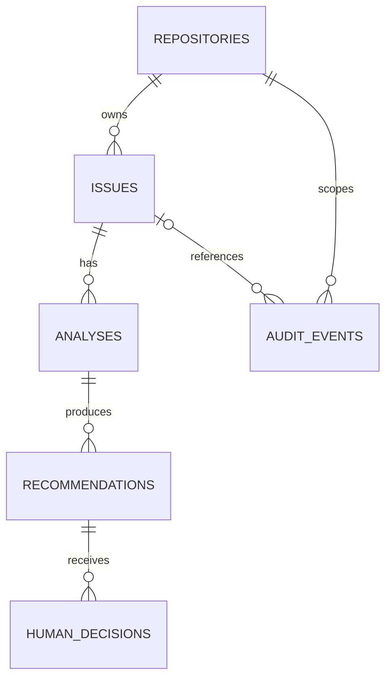

# ADR 0005: Initial Relational Model and Migrations

**Status:** Accepted
**Date:** 2026-08-31

## Context

Milestone 1.1 needs a minimal PostgreSQL model that preserves repository ownership and can later accommodate tenant and actor references without creating tenant-management or authentication behavior now.

## Decision

Use PostgreSQL UUID primary keys, timezone-aware `created_at` and `updated_at` timestamps, foreign keys, and indexes only for known relationship and lookup paths. The initial entities are `repositories`, `issues`, `analyses`, `recommendations`, `human_decisions`, and `audit_events`.

`repositories` are the aggregate root and carry a future-compatible `tenant_id` UUID without a tenant-table foreign key. An issue belongs to one repository; an analysis to one issue; a recommendation to one analysis; and a human decision to one recommendation. Audit events record a required repository reference and optional issue and actor UUID references. `actor_id` remains an identifier only until user management is introduced.

Issues store real source data: external issue number, title, body, state, and source URL. Enforce repository-scoped external issue-number uniqueness. Audit events are append-only by application convention; do not add triggers or event infrastructure.

SQLAlchemy ORM models and Pydantic API schemas remain separate. Alembic migrations must use the application database configuration and support upgrade and downgrade.

## Alternatives considered

Creating organization/user tables, database triggers, full tenant-management behavior, and broad enterprise abstractions is deferred because it exceeds Milestone 1.1.

## Consequences

Repository ownership is explicit from the first migration, while future tenant and actor integration does not require destructive primary-key changes.

## Security implications

Repository scope must be carried through future data access. Imported issue content remains untrusted and must be sanitized when importing begins.

## Testing/evidence

Prove migrations upgrade and downgrade, foreign-key and uniqueness constraints reject invalid data, and the ER diagram matches the migration.

## Revisit conditions

Revisit when organization/user management, authentication/RBAC, or cross-tenant enforcement is implemented.

## Deferred

GitHub importing; AI execution and prompt/model metadata; embeddings/RAG; authentication/RBAC; organization/user management; workers/queues; and automatic GitHub changes.